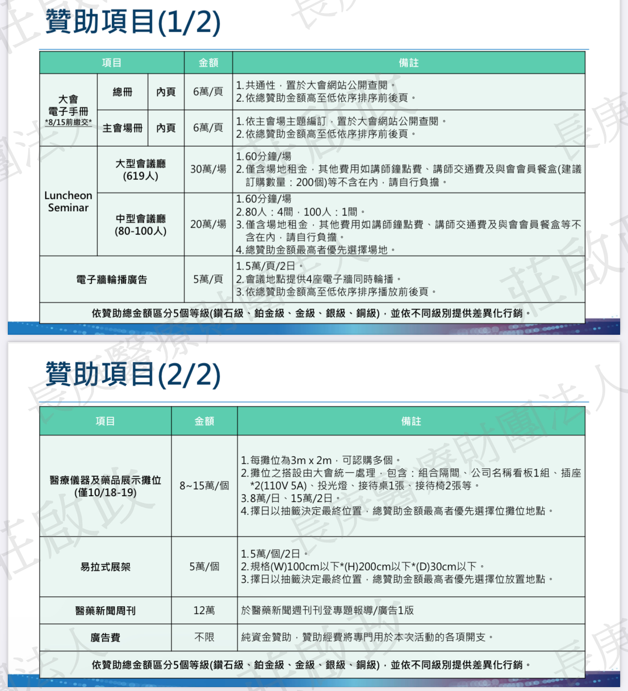

# 議題一: 會議時間
 - 時間:114年9月20日 + 21日(R5教育訓練)
 - 小兒神外: 合辦
 - 功能性神經外科(9/13-14) + 選舉

# 議題二: 贊助企劃
 - 3F 共15攤位
 - B1-8: 150000
 - B9-15: 180000
 - 場佈成本: ~23000
 - 手冊廣告: 120000-150000 -> 50000-100000
 - Lunch seminar(2名): 120000(大)-100000(小), 不含餐 (去年120000)
 - 茶點、午餐贊助: 50000
 - 理事長晚宴: 50000
 - 
 - 

# 議題三: R5教育訓練
 - R5口頭報告是否列入議程 ->禮拜日整天 or 半天
 - 神腫、顱底、腦下垂體共同討論
 - 準備大題目給住院醫師報告，可為手術影片、個案分享、系列分析?
 - 英文報告: 10分鐘報告，5分鐘Q&A，26人(29人?)
 - 分數統計，獎金?

# 議題四: Agenda
## 9/20
 - 會場: 國際會議中心2F/3F
 - 2F: lunch seminar
 - 2F上午後半場: 會員大會
 - 2F其他時段: 廠商workshop? 攤位優惠價?
 - 3F: 合辦主題
## 9/21
  - 會場: 2F簡報室 -> 是否增加會議室?
  - R5口頭報告整天

# 議題五: 主題
 - 大會主題: 復發性腦瘤的治療
 - 復發性膠質瘤治療
 - 臨床試驗

# 下次會議議題
 - 下次會議時間: 5/05
 - 小兒合辦?
 - 神腫/顱底手冊分開
 - 外師選項

# 會議前交辦事項
1. 神腫、顱底、腦下垂體共同討論R5口頭報告細項
2. 招商定案
